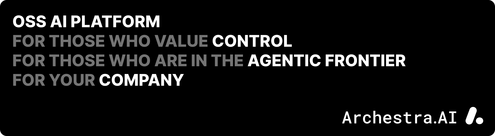

# Archestra.AI Open Source AI Platform

<div align="center">

[](LICENSE)


[](https://github.com/archestra-ai/archestra/graphs/contributors)

<p align="center">
  <a href="https://www.archestra.ai/docs/platform-quickstart">Getting Started</a>
  - <a href="https://github.com/archestra-ai/archestra/releases">Releases</a>
  - <a href="https://archestra.ai/join-slack">Slack Community</a>
</p>
</div>

All-in-one enterprise AI platform for those who are tired of wiring up kagent, kMCP, OpenWebUI, and LiteLLM — and still being frustrated by **reliability**, **governance**, **security**, **observability**, **cost tracking**, and **the general complexity of building a mature enterprise AI platform**.

- 💬 [Internal chat UI for non-technical users](https://archestra.ai/docs/platform-chat)
  - 👥 [Projects for collaboration](https://archestra.ai/docs/platform-projects)
  - 📱 [MCP Apps](https://archestra.ai/docs/platform-apps)
  - 💼 [Slack](https://archestra.ai/docs/platform-slack), [MS Teams](https://archestra.ai/docs/platform-ms-teams), and [Email](https://archestra.ai/docs/platform-agent-triggers-email) UIs
- 🛠️ [Developer LLM & MCP access portal](https://archestra.ai/docs/platform-llm-proxy) (Claude, Codex, etc.)
- 🚪 [LLM Gateway](https://archestra.ai/docs/platform-llm-proxy)
  - 🌐 [Any provider](https://archestra.ai/docs/platform-supported-llm-providers) (Anthropic, OpenAI, Azure, Bedrock, DeepSeek, and more)
  - 💰 [Cost management](https://archestra.ai/docs/platform-costs-and-limits)
  - 🔑 [Virtual API Keys](https://archestra.ai/docs/platform-llm-proxy-authentication)
  - 🎯 [Dynamic model optimization](https://archestra.ai/docs/platform-model-router-client-credentials-example)
- 🔌 [MCP Gateway](https://archestra.ai/docs/platform-mcp-gateway)
  - 🪪 [OAuth & On-Behalf-Of (OBO) for user-delegated MCP access](https://archestra.ai/docs/mcp-authentication)
- 🤝 [A2A Gateway](https://archestra.ai/docs/platform-agent-triggers-webhook-a2a)
- 📦 [Private MCP Registry](https://archestra.ai/docs/platform-private-registry)
- 🎼 [MCP Orchestrator](https://archestra.ai/docs/platform-orchestrator)
  - ☸️ [Kubernetes operator](https://archestra.ai/docs/platform-orchestrator)
  - 🚀 [Self-serve promotion mechanism and governance](https://archestra.ai/docs/platform-environments)
- 🤖 [Agent Runtime](https://archestra.ai/docs/platform-agents)
  - ⏰ Scheduled, [Email](https://archestra.ai/docs/platform-agent-triggers-email), and [Webhook (A2A)](https://archestra.ai/docs/platform-agent-triggers-webhook-a2a) triggers
  - 🧬 [Sub-agent delegation](https://archestra.ai/docs/platform-agents)
  - 🧠 [Reusable Agent Skills](https://archestra.ai/docs/platform-agent-skills-sharing)
  - ⚡ Sandboxed, blazing-fast code execution
  - 📁 K8S-native filesystem
- 📚 [RAG Knowledge Base](https://archestra.ai/docs/platform-knowledge-bases)
  - 🔗 [Knowledge Connectors for external sources](https://archestra.ai/docs/platform-knowledge-connectors)
- 🧩 [Mini app builder](https://archestra.ai/docs/platform-apps)
- 🛡️ [Deterministic Guardrails](https://archestra.ai/docs/platform-ai-tool-guardrails)
  - 🧪 [Dual LLM](https://archestra.ai/docs/platform-dual-llm) and [Lethal Trifecta](https://archestra.ai/docs/platform-lethal-trifecta) protections
- 🪪 [Identity & Access](https://archestra.ai/docs/platform-access-control)
  - 🔐 [SSO](https://archestra.ai/docs/platform-sso) (OIDC, SAML, Okta, and Microsoft Entra)
  - 👮 [RBAC with role mapping and team sync](https://archestra.ai/docs/platform-access-control)
  - 🗝️ [Secrets management](https://archestra.ai/docs/platform-secrets-management)
- 🌎 [Environments](https://archestra.ai/docs/platform-environments)
  - 🔒 [Per-environment network egress policies](https://archestra.ai/docs/platform-environments)
  - 💸 [Per-environment cost limits](https://archestra.ai/docs/platform-costs-and-limits)
- 🔭 [Observability](https://archestra.ai/docs/platform-observability)
  - 🪵 OpenTelemetry traces
  - 📊 Prometheus metrics
  - 📝 Logs
  - 💵 [Per-team cost tracking](https://archestra.ai/docs/platform-costs-and-limits)

Already running dangerous single-tenant agents like Claude Cowork, OpenClaw, or Hermes in your enterprise? [Migration Kit →](migration-kit/README.md)

## Quickstart

```
Run docker quickstart from https://archestra.ai/docs/platform-quickstart
```

## 👍 Ready for production

1. ✅ $13.5M total funding
2. ✅ Three Fortune-50 deployments
3. ✅ Lightning fast, 31ms at 95p: [Performance & Latency benchmarks →](https://archestra.ai/docs/platform-performance-benchmarks)
4. ✅ [Terraform provider →](https://github.com/archestra-ai/terraform-provider-archestra)
5. ✅ [Helm Chart →](https://archestra.ai/docs/platform-deployment#helm-deployment-recommended-for-production)

## 🤝 Contributing

We welcome contributions from the community!

- [Contribution Guidelines →](https://archestra.ai/docs/contributing)
- [Developer Quickstart →](https://archestra.ai/docs/platform-developer-quickstart)
- [Security & Bug Bounty →](https://archestra.ai/docs/security)

Thank you for contributing and continuously making <b>Archestra</b> better, <b>you're awesome</b> 🫶

<a href="https://github.com/archestra-ai/archestra/graphs/contributors">
  
</a>

---

<div align="center">
  <br />
  <a href="https://www.archestra.ai/blog/archestra-joins-cncf-linux-foundation"></a>
  &nbsp;&nbsp;&nbsp;&nbsp;&nbsp;&nbsp;
  <a href="https://www.archestra.ai/blog/archestra-joins-cncf-linux-foundation"></a>
</div>
