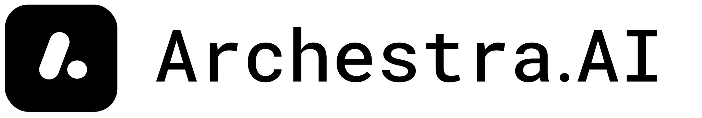

<div align="center">



**The all-in-one open-source enterprise AI platform.**

*Built on a strong security and observability foundation: SSO and RBAC,
sandboxed code execution, Dual-LLM and Lethal-Trifecta guardrails,
OpenTelemetry traces, and Prometheus metrics — first-class, not bolted on.*

[](LICENSE.md)
[](https://github.com/archestra-ai/archestra/releases)
[](https://github.com/archestra-ai/archestra/graphs/contributors)
[](https://github.com/archestra-ai/archestra/commits/main)
[](https://github.com/archestra-ai/archestra/pulse)

[Quickstart](https://archestra.ai/docs/platform-quickstart) &nbsp;·&nbsp;
[Docs](https://archestra.ai/docs/platform-overview) &nbsp;·&nbsp;
[Releases](https://github.com/archestra-ai/archestra/releases) &nbsp;·&nbsp;
[Slack](https://archestra.ai/join-slack)

<br />

<video src="https://github.com/user-attachments/assets/4b278679-9615-4d4a-9bd0-57d0585041c4" controls playsinline width="800"></video>

</div>

---

## What it does

Point your users — or your agents, or Claude / Codex / Cursor — at one URL. Archestra handles the rest:

- 💬 **Chat for non-technical users.** Internal AI assistant with
  [projects](https://archestra.ai/docs/platform-projects),
  [MCP apps](https://archestra.ai/docs/platform-apps), and
  [Slack](https://archestra.ai/docs/platform-slack),
  [MS Teams](https://archestra.ai/docs/platform-ms-teams), and
  [email](https://archestra.ai/docs/platform-agent-triggers-email)
  front-ends.
- 🛠️ **Developer LLM & MCP portal.** One token for Claude Code, Codex,
  Cursor — see the [proxy](https://archestra.ai/docs/platform-llm-proxy).
- 🚪 **LLM gateway** for [any provider](https://archestra.ai/docs/platform-supported-llm-providers)
  (Anthropic, OpenAI, Azure, Bedrock, DeepSeek, …) with
  [cost limits](https://archestra.ai/docs/platform-costs-and-limits),
  [virtual API keys](https://archestra.ai/docs/platform-llm-proxy-authentication),
  and [dynamic model routing](https://archestra.ai/docs/platform-model-router-client-credentials-example).
- 🔌 **MCP gateway** with [OAuth + On-Behalf-Of](https://archestra.ai/docs/mcp-authentication)
  so tools run as the user, not a shared service account.
- 🤝 **A2A gateway** for [agent-to-agent triggers](https://archestra.ai/docs/platform-agent-triggers-webhook-a2a).
- 📦 **Private MCP registry** so teams ship their own tools — see
  [registry docs](https://archestra.ai/docs/platform-private-registry).
- 🎼 **MCP orchestrator** with a
  [Kubernetes operator](https://archestra.ai/docs/platform-orchestrator) and
  [self-serve promotion](https://archestra.ai/docs/platform-environments).
- 🤖 **Agent runtime** with [scheduled / email / webhook triggers](https://archestra.ai/docs/platform-agents),
  [sub-agent delegation](https://archestra.ai/docs/platform-agents),
  [reusable skills](https://archestra.ai/docs/platform-agent-skills-sharing),
  sandboxed code execution, and a K8s-native filesystem.
- 📚 **RAG knowledge base** plumbed via
  [connectors](https://archestra.ai/docs/platform-knowledge-connectors) to
  your existing stack.
- 🧩 **Mini app builder** — see [apps](https://archestra.ai/docs/platform-apps).
- 🛡️ **Deterministic guardrails** for [tool calls](https://archestra.ai/docs/platform-ai-tool-guardrails),
  [Dual-LLM](https://archestra.ai/docs/platform-dual-llm) verification, and
  [Lethal Trifecta](https://archestra.ai/docs/platform-lethal-trifecta) protections.
- 🪪 **Identity & access** with [SSO](https://archestra.ai/docs/platform-sso)
  (OIDC, SAML, Okta, Entra), [RBAC with role mapping & team sync](https://archestra.ai/docs/platform-access-control),
  and [secrets management](https://archestra.ai/docs/platform-secrets-management).
- 🌎 **Environments** with [per-env egress policies](https://archestra.ai/docs/platform-environments)
  and [per-env cost limits](https://archestra.ai/docs/platform-costs-and-limits).
- 🔭 **Observability** out of the box: OpenTelemetry traces, Prometheus
  metrics, logs, [per-team cost tracking](https://archestra.ai/docs/platform-costs-and-limits).

> Already running dangerous single-tenant agents like Claude Cowork,
> OpenClaw, or Hermes in your enterprise? **[Migration Kit →](migration-kit/README.md)**

## Quickstart

```bash
docker pull archestra/platform:latest

docker run \
  -p 127.0.0.1:9000:9000 -p 127.0.0.1:3000:3000 \
  -e ARCHESTRA_QUICKSTART=true \
  -e ARCHESTRA_BETA=true \
  -v /var/run/docker.sock:/var/run/docker.sock \
  -v archestra-postgres-data:/var/lib/postgresql/data \
  -v archestra-app-data:/app/data \
  archestra/platform
```

Open <http://localhost:3000>. Full Docker / Helm / Kubernetes instructions
live in the [quickstart docs](https://archestra.ai/docs/platform-quickstart).

## Ready for production

- ✅ $13.5M total funding
- ✅ Three Fortune-50 deployments
- ✅ 31 ms at p95 — [performance benchmarks →](https://archestra.ai/docs/platform-performance-benchmarks)
- ✅ [Terraform provider →](https://github.com/archestra-ai/terraform-provider-archestra)
- ✅ [Helm chart →](https://archestra.ai/docs/platform-deployment#helm-deployment-recommended-for-production)

## Deeper docs

- 📖 [**Platform overview**](https://archestra.ai/docs/platform-overview) —
  what's in the box, how the pieces fit together.
- 📐 [**Deployment**](https://archestra.ai/docs/platform-deployment) —
  Docker, Helm, Kubernetes, every env var, secrets management.
- 💰 [**Pricing model**](https://archestra.ai/docs/platform-pricing-model) —
  Open Core, free for teams under 30 users, enterprise licensing.
- 🛡️ [**Security & bug bounty**](https://archestra.ai/docs/security)
- 🤝 [**Contributing**](https://archestra.ai/docs/contributing) —
  set up the dev env, run e2e tests, open a PR.

Thank you for continuously making **Archestra** better — you're awesome 🫶

<a href="https://github.com/archestra-ai/archestra/graphs/contributors">
  
</a>

## Star history

<a href="https://star-history.com/#archestra-ai/archestra&Date">
  <picture>
    <source media="(prefers-color-scheme: dark)" srcset="https://api.star-history.com/svg?repos=archestra-ai/archestra&type=Date&theme=dark" />
    <source media="(prefers-color-scheme: light)" srcset="https://api.star-history.com/svg?repos=archestra-ai/archestra&type=Date" />
    
  </picture>
</a>

---

<div align="center">
  <br />
  <a href="https://www.archestra.ai/blog/archestra-joins-cncf-linux-foundation"></a>
  &nbsp;&nbsp;&nbsp;&nbsp;&nbsp;&nbsp;
  <a href="https://www.archestra.ai/blog/archestra-joins-cncf-linux-foundation"></a>
</div>
